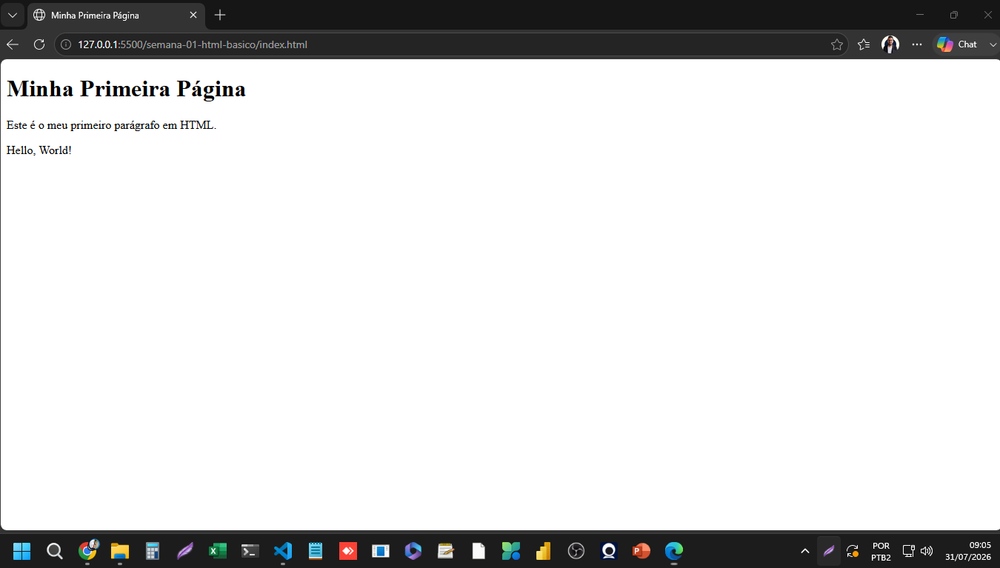
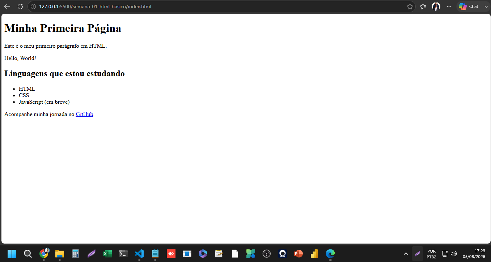

# Semana 1 - HTML Básico

## O que é HTML?

HTML significa HyperText Markup Language (Linguagem de Marcação de Hipertexto).

- HTML não é uma linguagem de programação, é uma linguagem de marcação.
  Não tem lógica (sem cálculos, sem "se isso, então aquilo").
- Serve para estruturar o conteúdo de uma página: títulos, parágrafos,
  imagens, links, listas, etc.
- Usa tags para isso. Exemplo: <h1> marca um título, <p> marca um parágrafo.

Analogia: se uma página web fosse uma casa, o HTML é a estrutura
(paredes, cômodos, portas). O CSS decora. O JavaScript dá interatividade.

## Print da primeira página



## Evidência - Renderização no navegador



Página HTML renderizada no navegador via Live Server, demonstrando a
aplicação prática dos elementos `<h1>`, `<p>`, `<ul>`/`<li>` (lista não
ordenada) e `<a>` (link com atributo target="_blank").

## Observações
- Testei a estrutura básica no navegador usando Live Server.
- Tags h1 e p já renderizam conteúdo visível na página.
- Live Server abre no navegador padrão do sistema, não necessariamente o Chrome.
- Fiz o tradicional "Hello, World!" em HTML 🎉
- Aprendi que tags HTML escritas como texto dentro do Markdown (ex: `<h1>`,
  `<p>`) precisam estar entre crases, senão o GitHub tenta renderizá-las
  como código real, quebrando a formatação da página.

## Listas em HTML

Listas são usadas para organizar informações relacionadas de forma visual
e semântica — ou seja, o HTML não só mostra os itens, mas também comunica
ao navegador (e a leitores de tela, para acessibilidade) que aquilo é um
conjunto de itens relacionados. Por isso usar `<ul>`/`<li>` é considerado boa
prática, em vez de simplesmente separar textos com quebras de linha.

**Lista não ordenada (`<ul>`)** — usada quando a ordem não importa:
```html
<ul>
    <li>HTML</li>
    <li>CSS</li>
    <li>JavaScript</li>
</ul>
```
- `<ul>` = Unordered List (Lista Não Ordenada), o container que agrupa os itens
- `<li>` = List Item, cada item individual
- Por padrão, o navegador exibe cada item com um marcador (•)

**Lista ordenada (`<ol>`)** — usada quando a sequência importa:
```html
<ol>
    <li>Primeiro passo</li>
    <li>Segundo passo</li>
</ol>
```
- `<ol>` = Ordered List (Lista Ordenada), numera automaticamente os itens

## Links em HTML

O link (ou "âncora") é o que torna a web de fato uma rede — a possibilidade
de conectar uma página a outra é a essência do "Hyper" em HyperText.

```html
<a href="https://github.com/TiagoSilva00" target="_blank">GitHub</a>
```
- `<a>` = Anchor (Âncora), a tag responsável por criar links
- `href` = Hypertext Reference, define para onde o link aponta
- `target="_blank"` faz o link abrir em uma nova aba
- O texto entre `<a>` e `</a>` é o que fica visível e clicável

## Aplicação prática
Adicionei ao index.html uma lista das linguagens que estou estudando
(HTML, CSS, JavaScript) e um link para meu perfil no GitHub.